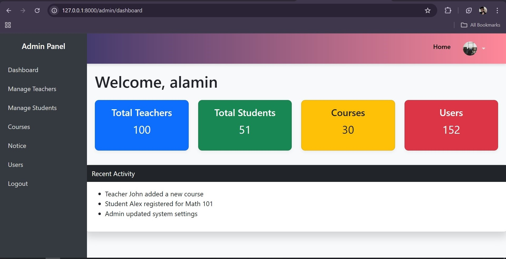
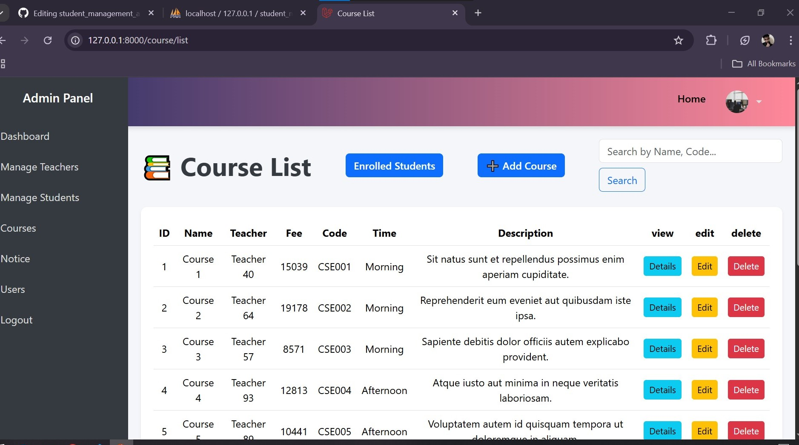
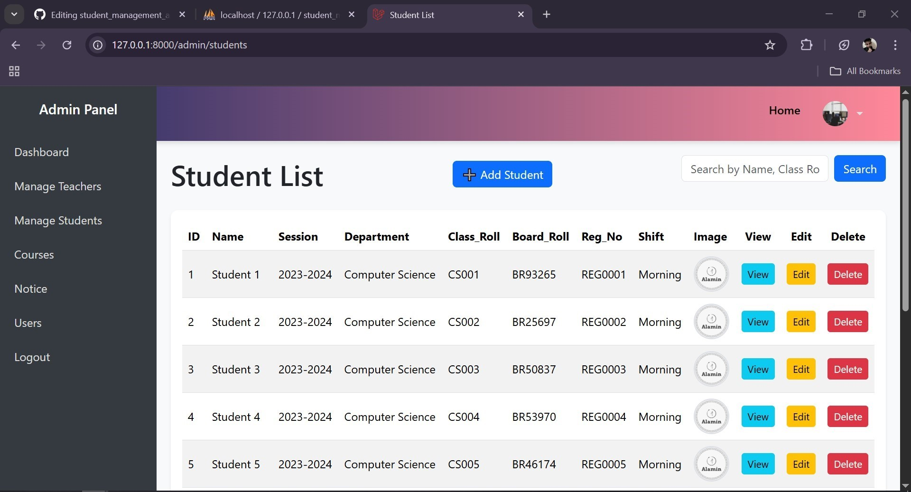
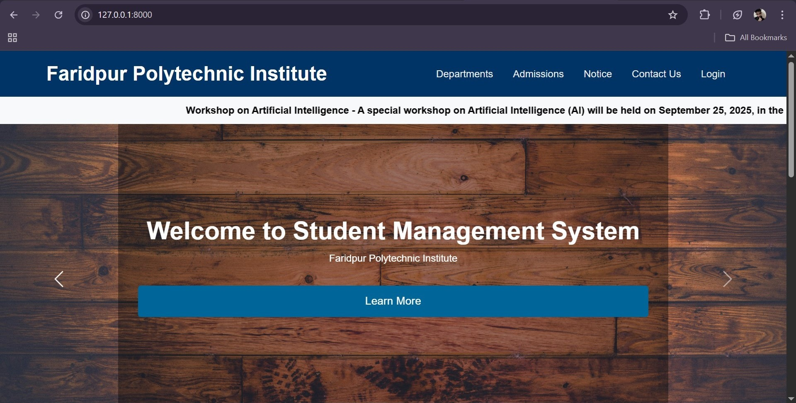
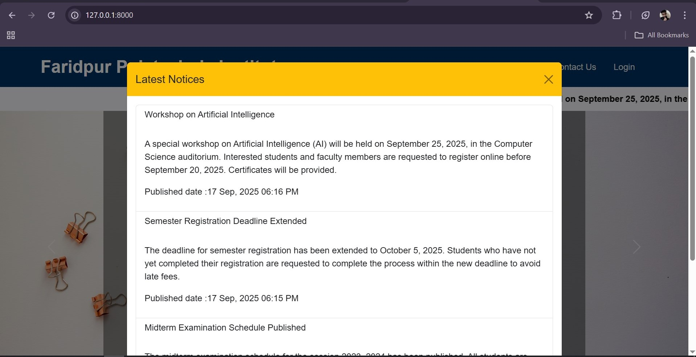
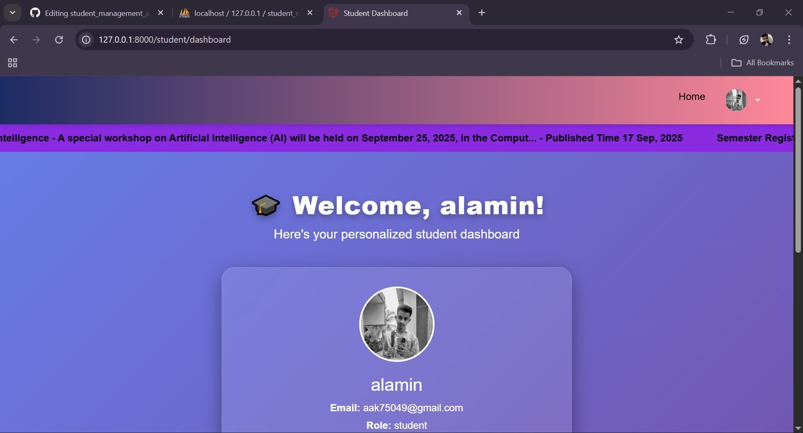
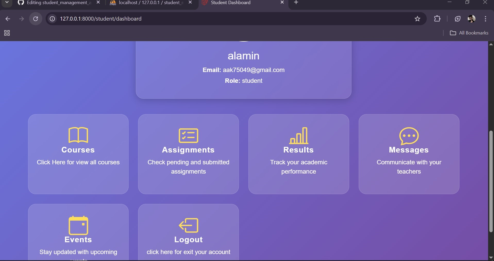
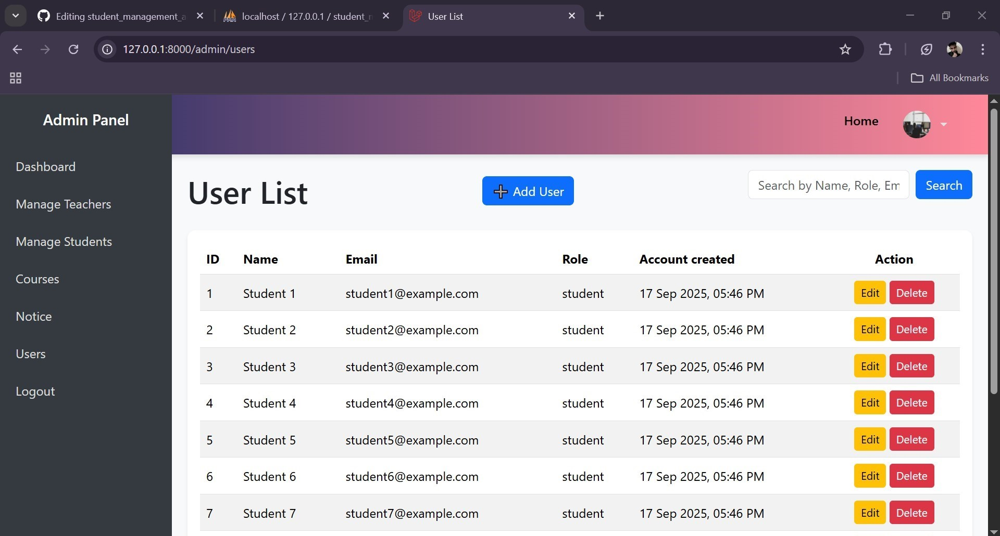

# 🎓 Student Management System

This project is built purely for learning purposes. It’s a simple multi-authentication system developed using Laravel, designed to help explore and practice real-world web development concepts like role-based access control, route protection, and user management.

---

## 🚀 Features

- 👨‍🎓 Student registration, profile update, and dashboard
- 👩‍🏫 Teacher management with role-based access
- 🧑‍💼 Admin dashboard with full control over users, courses, and notices
- 📚 Course creation, enrollment, and listing
- 📢 Notice board for announcements
- 🔐 Multi-role authentication (Admin, Teacher, Student)
- 🛡️ Middleware-based route protection
- ✨ Flash messages for better UX feedback

---

## 🛠️ Tech Stack

| Layer        | Technology        |
|--------------|------------------|
| Backend      | Laravel 12+       |
| Frontend     | Blade + Bootstrap |
| Database     | MySQL             |
| Auth System  | Laravel Breeze / Custom Middleware |
| Language     | PHP               |

---

## ⚙️ Installation

To run this project locally:

```bash
git clone https://github.com/Alamin648441/student_management_app.git
cd student_management_app
composer install
cp .env.example .env
php artisan key:generate
php artisan migrate
php artisan serve
```
Learning Goals

This project helped me practice:

Laravel route grouping and middleware

Multi-role access control

Controller structure and resource management

Flash alerts and user feedback

Real-world debugging and code organization

Acknowledgements

Special thanks to the Laravel community and documentation for guidance.
This project is not intended for production use—it’s a personal learning sandbox.


##Screenshot
## 🖼️ Screenshots

<p align="center">

  <a href="public/imagesGitReadme/admin_dashboard.jpg" target="_blank">
    
  </a>

  <a href="public/imagesGitReadme/admin_course.jpg" target="_blank">
    
  </a>

  <a href="public/imagesGitReadme/admin_student.jpg" target="_blank">
    
  </a>

  <a href="public/imagesGitReadme/dashboard.jpg" target="_blank">
    
  </a>

  <a href="public/imagesGitReadme/dashboard-with-notice.jpg" target="_blank">
    
  </a>

  <a href="public/imagesGitReadme/enrolled course.jpg" target="_blank">
    
  </a>

  <a href="public/imagesGitReadme/student-dashboard.jpg" target="_blank">
    
  </a>

  <a href="public/imagesGitReadme/student-dashboard-footer.jpg" target="_blank">
    
  </a>

  <a href="public/imagesGitReadme/user.jpg" target="_blank">
    
  </a>

</p>

